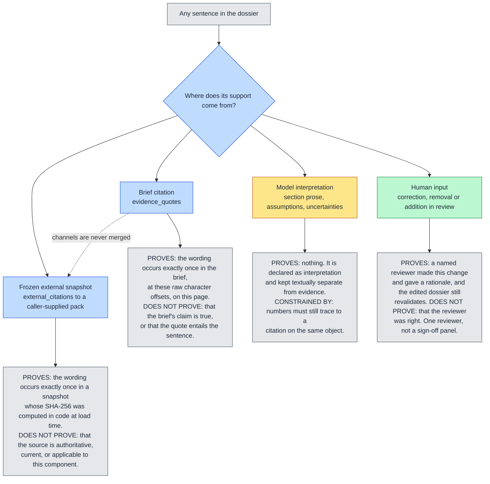
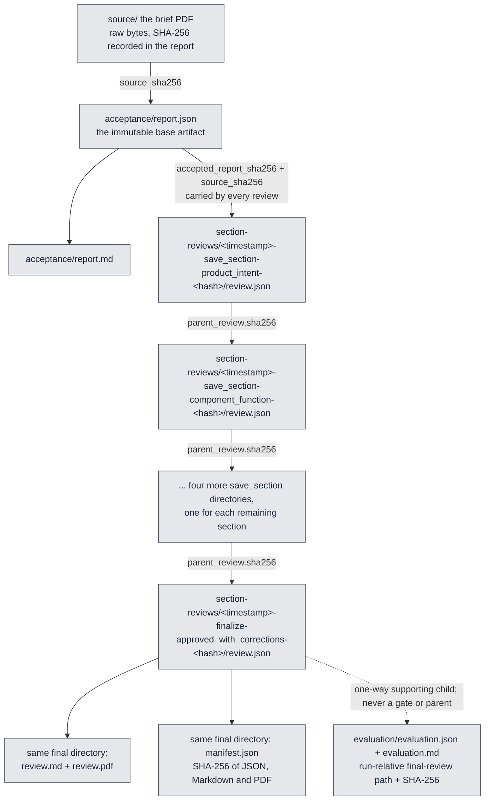

# Traceable Brief Translator

[](https://github.com/Ninadnj/traceable-brief-translator/actions/workflows/ci.yml)

**[Open the live Streamlit demo](https://traceable-brief-translator-pebssqcwrpql6v8spzsxu5.streamlit.app/)**

Traceable Brief Translator is the current CompoundX demonstration. It turns one
incomplete product brief into a six-section, traceable engineering dossier:
product intent, component function, performance to validate, material-relevant
criteria, missing information, and conflicts and trade-offs. A language model
proposes the meaning. Deterministic Python proves provenance — exact source
quotations, raw character offsets, PDF page numbers, and numeric support. A human
owns the engineering judgement, section by section, on the record. **AI proposes
meaning, deterministic code proves traceability, a human owns engineering
judgement.**

## The problem

Product teams write in product language: "must survive winter use", "should not
feel less robust", "should not look noticeably lower quality". A material
decision needs technical criteria — conditions, observable behaviours, limits,
and the evidence behind them. The translation between the two is exactly where an
unsupported number gets invented and then quoted downstream as if it were a
requirement.

So this system is built to fail loudly instead of quietly. A strong result here
often concludes that a requirement **cannot yet be quantified** and names the
missing definition, baseline or measurement. That outcome is more useful to an
engineer than a plausible number nobody can trace.

## Quickstart

Requires Python 3.11 or later.

```bash
python -m venv .venv
source .venv/bin/activate
python -m pip install -r requirements.txt
streamlit run streamlit_app.py
```

**No API key is needed to explore the demonstration.** With no live run in the
session, the app loads a saved report from `demo-results/`. Both cases contain
fresh, mechanically eligible live-model reports and completed human-review
chains. The Review tab shows the finalized, read-only decision by Nina
Doinjashvili; the Final report tab presents the reviewed JSON and PDF plus the
separately labelled model-assisted rubric. The repository also ships every
parent snapshot and the final hash manifest. A key is required only to translate
a *new* brief; it is read from the browser session, never written to an artifact,
and redacted from any error text that gets persisted.

For a live run from the command line:

```bash
export OPENAI_API_KEY=...
compoundx-demo \
  --brief demo-results/roller-skate/source/junior_roller_skate_target_brief.pdf \
  --output-dir runs/my-run \
  --model <openai-model-id>
```

Live translation runs go to `runs/`, which is gitignored, so using the app never
adds a third case to `demo-results/`. Section reviews are written beside the
report they review, because a review is parent-linked to a specific accepted
report and its lineage depends on staying with it — so reviewing a curated case
in the UI does add directories under `demo-results/<case>/section-reviews/`.

A model ID has to be supplied on every run — the `--model` flag, the
`COMPOUNDX_DEMO_MODEL` environment variable, or the model field in the UI.
There is no default: nothing runs until one is given.
`--critic-model` runs the critic on a different model to reduce correlated
errors. `--external-sources` takes a frozen snapshot pack. The command exits `0`
when the run is mechanically clean, `2` when validation or the critic pass
produced errors, and `1` on a configuration or IO failure. An existing output
directory is never overwritten.

## Pipeline

```mermaid
flowchart TB
    PDF["Product brief<br/>text-based PDF, or any UTF-8 text file<br/>read as plain text"]:::io
    LOAD["source_loader.py<br/>extract text, SHA-256 the raw bytes,<br/>record per-page character spans for paginated sources"]:::code
    T["translator.py + prompts/translator.txt<br/>LLM pass 1"]:::model
    D["TechnicalDossier<br/>six sections; every section and list item<br/>carries at least one citation"]:::io
    V["verifier.py<br/>exact-quote resolution, page mapping,<br/>same-object numeric provenance"]:::code
    R{"Any deterministic<br/>translation errors?"}:::code
    FIX["translation_repair.py + prompts/translator_repair.txt<br/>one bounded LLM repair; initial state retained"]:::model
    C["critic.py + prompts/critic.txt<br/>semantic critic pass"]:::model
    F["CriticOutput<br/>exactly one finding per section:<br/>supported, revise or uncertain"]:::io
    VC["verify_critic<br/>section coverage, exact quotes on critic<br/>evidence and on any critic addition"]:::code
    REP["acceptance/report.json + report.md<br/>source text, spans, findings, every error"]:::io
    POL["Review eligibility gate<br/>zero translation or critic validation errors"]:::code
    SR["section_review.py<br/>six independent decisions;<br/>every correction needs a rationale"]:::human
    RV["verify_dossier rerun over the edited dossier<br/>on every save"]:::code
    FIN["final review.json + review.md + review.pdf<br/>+ manifest.json of content hashes"]:::io
    EVAL["evaluation/evaluation.json + evaluation.md<br/>model-assisted rubric; supporting and non-gating"]:::model

    PDF --> LOAD --> T --> D --> V --> R
    R -->|"yes; at most once"| FIX --> V
    R -->|"no; validation is an input"| C
    C --> F --> VC --> REP --> POL --> SR --> RV --> FIN
    RV -->|"any invalid content blocks approval"| SR
    FIN -.->|"one-way, hash-linked supporting evaluation"| EVAL

    subgraph legend["Legend"]
        direction LR
        L1["LLM judgement"]:::model
        L2["Deterministic Python"]:::code
        L3["Human decision"]:::human
        L4["Artifact on disk"]:::io
    end

    classDef model fill:#fde68a,stroke:#b45309,stroke-width:1px,color:#1f2937;
    classDef code fill:#bfdbfe,stroke:#1d4ed8,stroke-width:1px,color:#1f2937;
    classDef human fill:#bbf7d0,stroke:#15803d,stroke-width:1px,color:#1f2937;
    classDef io fill:#e5e7eb,stroke:#4b5563,stroke-width:1px,color:#1f2937;
```



**Load.** One input boundary. Text-based PDFs are extracted page by page and each
page's exact character range in the persisted text is recorded, which is what
makes a page number recoverable later. The raw file bytes are hashed. A PDF with
no extractable text is rejected with an instruction to run OCR, not silently
translated.

**Translate.** One structured-output call returns a `TechnicalDossier`. The model
writes prose, assumptions, uncertainties and citations. It never writes offsets,
page numbers or hashes — code owns those — and it cannot mint an identifier: the
only ID it may use is a `source_id` the caller already supplied, and an unknown
one is an error. The schema itself refuses a section or list item with no
citation at all.

**Verify and bounded repair.** Every citation is resolved against the preserved source text. Every
number in an output object is checked against the citations attached to *that*
object. Failures are recorded as typed errors on the object and the object is
marked invalid. If the initial dossier has an error, one model repair pass receives
the complete typed validation result. The initial dossier and validation are
retained, the repaired dossier is reverified from scratch, and any remaining error
still blocks acceptance. Code never invents or silently rewrites engineering text.

**Critique.** A separate pass reads the brief, the final dossier and the mechanical
validation, and returns exactly one finding per section plus optional additions.
It records direct, partial or insufficient support, typed semantic issues, exact
translator excerpts, and source-only evidence quotations. Its own quotes are
verified the same way. Findings are reviewable proposals, not proof. There is no
autonomous loop or framework; the only repair is the single validation-triggered
pass described above.

**Report.** `report.json` is the complete artifact: source text, page spans,
external snapshots, both model calls, the dossier, every validation error, the
critic output, and the declared limitations. `report.md` is a deterministic
rendering of the same data.

**Review.** A reviewer approves, corrects or flags each of the six sections
independently. Each save is a new immutable snapshot linked to its parent by
hash, and the whole edited dossier is re-verified on every save. Finalising
requires all six decisions plus a written decision rationale. Both shipped
cases contain six section saves followed by one finalized
`approved_with_corrections` record by Nina Doinjashvili; their reviewed dossiers
revalidate with zero errors.

**Evaluate separately.** A disclosed model-assisted rubric may evaluate the
canonical finalized review after the human decision. It links to that exact
`review.json` by a run-relative path and SHA-256, but it is a one-way supporting
child: it neither participates in mechanical eligibility nor changes or
independently confirms the human decision.

## Deterministic vs model judgement

| Question | Owner | How it is settled |
| --- | --- | --- |
| What does this brief mean, and which of the six sections does it belong in? | Model | LLM pass 1, structured output |
| Does this quote appear verbatim in the source? | Code | `citation_matching.normalized_exact_matches`; more than one occurrence is an *error*, not a pick-the-first |
| Where in the raw source, and on which PDF page? | Code | Normalized offsets mapped back to raw offsets; page spans recorded at load |
| Is every number in this object supported by this object's own citations? | Code | `verifier._validate_content`; failures become `unsupported_number` errors |
| Are there six sections, at least one citation each, and exactly one critic finding per section? | Code | Pydantic contracts plus `verify_critic` |
| Is the external snapshot the one that was cited? | Code | SHA-256 computed by the loader, not supplied by the caller or the model |
| Does the citation actually *entail* the sentence built on it? | Human | Not proven by code; the critic only proposes |
| Is a qualifier's force preserved — "preferred" still preferred, not mandatory? | Model proposal; human decision | Prompt constraints and typed critic findings exposed the shifts; Nina Doinjashvili corrected and approved both published reviewed dossiers |
| Is the dossier decision-useful and correctly levelled? | Critic proposal; human decision; separate supporting rubric | Structured findings guide review; the published model-assisted rubric evaluates the finalized reviewed JSON without becoming an approval gate |
| Does this run pass, and is this review approved? | Code derives status; human supplies decisions | Rubric `overall_pass` and review `overall_status` are computed from their inputs; neither can be supplied directly by the evaluator or reviewer |
| Is this material suitable? | Out of scope | The system produces criteria and open questions, not a material choice |

## Trust and provenance model



Brief citations are verified against the brief only; external citations are
verified against their frozen snapshot only; an unknown `source_id` is an error.
The two channels are stored, validated and rendered separately, so a reader can
always tell supplied facts from introduced ones. Live web retrieval is
deliberately out of scope — see `docs/EXTERNAL_KNOWLEDGE.md`.

## Guarantees a reviewer can check

**Exact-quote traceability with raw offsets and page numbers.** Matching is
narrow by design. `citation_matching.py` treats only Unicode NFKC compatibility
forms, curly-quote variants, dash and hyphen variants, whitespace layout, and
hyphenation introduced by a line break as equivalent — the artefacts of PDF
extraction. That last one is ambiguous rather than merely noisy: a hyphen at a
line break may be a compound split by justification (`low-gloss`) or one word
broken mid-syllable (`scheduling`), and nothing in the text distinguishes them.
Each such hyphen is marked optional and resolved by the quote itself, per site,
so one quote can join a compound and close a mid-syllable break at the same time.
Resolving it globally instead would be unsound: a statement appearing once broken
and once intact would be counted once and certified unique. Only `-`, the soft
hyphen and the Unicode hyphens are breakable — an em dash at a line end is never
a split word. Wording, order, case and punctuation must still agree, so a
paraphrase fails. Every normalized offset is
mapped back to an offset in the untouched source, and the exact raw slice is
stored alongside the model's quote. A quote that matches more than once is an
`ambiguous_quote` error rather than an arbitrary choice.

In the two refreshed demonstrations every translation citation resolved to a
page: 74 evidence spans for roller-skate and 101 for garden-trimmer, all
page-numbered. The critic adds its own separately verified source quotations.

```bash
python -c "import json;d=json.load(open('demo-results/roller-skate/acceptance/report.json'));\
s=[x for c in d['translation_validation']['contents'] for x in c['evidence_spans']];\
print(len(s),'spans',sum(1 for x in s if x['page_number'] is not None),'with pages')"
```

**Same-object numeric provenance.** Every number in an object's text,
assumptions and uncertainties must appear in a citation attached to *that same
object*. A number cited in another section does not support it here. Comparison
is by parsed decimal value, so digits and written numbers unify.

There is exactly one documented exclusion, and it is narrow: a digit run
*introduced* by a letter or underscore, or joined directly to a following
underscore, is a name rather than a measurement — `PA6`, `R_2` — and is skipped
on both sides of the comparison. A value fused to its unit is not excluded:
`250g`, `30mm` and `2.5mm` are measurements and are checked. That direction
matters, because the rule skips excluded tokens on both sides, so widening the
exclusion to a trailing letter would let a fabricated number bypass the check
entirely just by being written next to its unit.
`tests/test_quantities.py` and `tests/test_translation_contract.py` pin that
boundary in both directions.

A number without support produces an `unsupported_number` error, is listed in
`unsupported_numbers`, and marks that object invalid — which in turn blocks run
acceptance and blocks review approval.

**Qualifier-force preservation.** "Preferred" must not become "mandatory", and a
mandatory minimum must not be softened into a preference. This one is not a
deterministic proof and is not presented as one: it is enforced by explicit
prompt constraints, listed as a typed critic failure mode, and exposed for human
confirmation. The refreshed reports demonstrate this channel directly: the
critic flags wording that hardens a qualified cost constraint.

**Snapshot digest integrity.** Snapshot digests are computed by
`external_sources.py` at load time from the snapshot text, so a caller cannot
declare a hash for content it did not supply, and duplicate source IDs are
rejected as ambiguous provenance.

**Nothing is repaired silently.** If the bounded repair pass is triggered, the
report retains the initial dossier, its validation, the repair call metadata and
the final revalidated dossier. Invalid content, unsupported numbers and critic
revisions remain visible. The two refreshed reports did not need repair, which is
recorded by their null repair fields.

## Artifact lineage



A review can only start from an `acceptance/report.json`, and that report is
re-verified on load — a base report that no longer passes current deterministic
validation cannot be reviewed at all. Each snapshot carries the accepted report
hash, the source hash and its parent's hash, so the chain is checkable without
trusting any single file. Reviews are written to new directories and never
overwritten. `review.md` and `review.pdf` are deterministic renderings of
`review.json`; the manifest exists so a reader can confirm the PDF they were
handed matches the JSON audit record. Directory names carry the timestamp,
action, section or terminal-status qualifier, and a content-hash prefix. Each
current demonstration contains six parent-linked `save_section` snapshots and
one terminal `finalize` snapshot. Its evaluation is a hash-linked child of the
terminal JSON only; it cannot reopen or extend the review chain.

## Demonstrations

| | `roller-skate` | `garden-trimmer` |
| --- | --- | --- |
| Role | The technical case's target brief | An additional, different product, used adversarially |
| Source | 2-page PDF, 4378 extracted characters | 3-page PDF, 6489 extracted characters |
| Deterministic validation | 12 of 12 contents valid, 0 errors | 11 of 11 contents valid, 0 errors |
| Critic contract validation | 0 errors | 0 errors |
| Semantic critic | 4 sections marked `revise`; 1 added missing-information point | 3 sections marked `revise`; 1 added missing-information point |
| Human review | Nina Doinjashvili; 6 saves; `approved_with_corrections` | Nina Doinjashvili; 6 saves; `approved_with_corrections` |
| Reviewed-dossier validation | 13 of 13 contents valid, 0 errors | 12 of 12 contents valid, 0 errors |
| Final deliverables | reviewed JSON, Markdown, PDF and hash manifest | reviewed JSON, Markdown, PDF and hash manifest |
| Separate semantic rubric | model-assisted; 4.75/5 mean; all adversarial checks pass | model-assisted; 4.75/5 mean; all adversarial checks pass |

Both reports were generated live with `gpt-5.6-sol` on 2026-08-02 using the same
code and prompts. They demonstrate the intended hybrid boundary: deterministic
checks prove exact quotation and same-object numeric provenance, while the AI
critic identifies claim-level evidence gaps, qualifier changes, omissions and
over-broad wording. Nina Doinjashvili reviewed those findings, corrected the
affected sections, added one missing-information item per case, and approved
both dossiers. The base model reports and critic findings remain unchanged in
the lineage; the reviewed dossiers contain 13 and 12 valid content objects
respectively.

Each finalized reviewed JSON was then scored as a separate, explicitly
`model_assisted` supporting evaluation. Both use criterion scores
`[5, 5, 5, 4, 5, 5, 5, 4]` (mean 4.75/5), pass every case-specific adversarial
check, and therefore pass the rubric's computed rule. That result is not a
second human approval, a mechanical semantic proof, or an input to review
eligibility.

```bash
python -c "import json;d=json.load(open('demo-results/garden-trimmer/acceptance/report.json'));\
v=d['translation_validation']['contents'];print(sum(c['valid'] for c in v),'/',len(v),'valid');\
print([f['section'] for f in d['critic']['findings'] if f['human_review_required']])"
```

## Verification

```bash
python -m pytest
```

The suite runs offline against scripted clients; no test makes a network call, so
it runs identically on a laptop and in CI. GitHub Actions
(`.github/workflows/ci.yml`) runs it on Python 3.11 and 3.13 on every push and
pull request, then re-verifies that both shipped demo artifacts still validate
12/12 and 11/11, that both critic contracts validate, and that the package
builds. The test suite additionally walks both published seven-record review
chains, checks every accepted-report/source/parent hash, rechecks each terminal
status and reviewed dossier, verifies the final JSON/Markdown/PDF manifest and a
readable PDF, and proves that each rubric targets that exact run-relative final
review JSON and hash. The artifact checks are there because
the demo results are this project's evidence: a change that silently breaks their
citation or numeric provenance should fail the build, not the demo.

It covers:

- `tests/test_citation_matching.py` — normalization boundaries: PDF layout
  differences match, paraphrase, synonym, case and word-order changes do not,
  duplicates stay ambiguous, and match offsets index the raw source text.
- `tests/test_quantities.py` — numeric token extraction, written numbers,
  ranges and signs, the identifier-versus-measurement boundary, and prose
  false-positive avoidance.
- `tests/test_translation_contract.py` — the six-section contract, the
  same-object numeric rule including a fabricated number fused to its unit,
  normalized offsets mapping back to exact raw page spans, critic section
  coverage including duplicate and missing findings, and the prompt contract
  itself.
- `tests/test_external_knowledge.py` — the frozen-snapshot channel: digests
  assigned in code, unknown source IDs, and separation from brief evidence.
- `tests/test_pipeline_contract.py` — end-to-end translate, verify, critique,
  bounded repair, reverify, critique and render with a scripted client.
- `tests/test_section_review.py`, `tests/test_flagged_section_review.py` —
  immutability, parent linking, required rationales, list add/remove/correct
  accounting, derived overall status, blocked approval on invalid content, and
  the final Markdown/PDF/manifest write.
- `tests/test_semantic_evaluation.py` — every rubric criterion scored once,
  `overall_pass` derived rather than supplied, immutable writes, and rendered
  evaluated-artifact identity.
- `tests/test_published_demo_artifacts.py` — both shipped parent chains, terminal
  status, reviewer, reviewed-dossier validation, manifest/PDF hashes, and exact
  final-review-to-evaluation link.
- `tests/test_demo_app.py`, `tests/test_cli_branding.py` — session-only key
  handling, content-addressed saved sources, immutable terminal-chain handling,
  supporting-evaluation linking, and CLI and repository invariants.

The shipped base reports are mechanically eligible model outputs. Their linked
terminal artifacts record one named human review and approval with corrections;
their rubric artifacts are model-assisted supporting evidence only. None of
these artifacts establishes design safety, physical root cause, or material
suitability.

## Repository layout

```
src/compoundx/
  source_loader.py        one input boundary; PDF page spans, byte hashing, OCR refusal
  source.py               exact UTF-8 loading and content hashing
  translator.py           LLM pass 1              prompts/translator.txt
  translation_repair.py   optional bounded repair prompts/translator_repair.txt
  critic.py               semantic critic pass    prompts/critic.txt
  model_client.py         the only provider call; OpenAI structured outputs, store=False
  schemas.py              pydantic contracts: dossier, findings, validation, report
  models.py               shared strict base models and enums
  citation_matching.py    bounded normalization and raw-offset recovery
  quantities.py           numeric token and quantity extraction
  verifier.py             the deterministic guarantees
  external_sources.py     frozen snapshot pack loader; digests assigned in code
  section_review.py       immutable parent-linked human review and final manifest
  semantic_evaluation.py  rubric artifact; overall_pass computed
  renderer.py             report.md
  review_pdf.py           review.pdf
  artifact_io.py          atomic, non-overwriting artifact writes
  pipeline.py             translate, verify, optionally repair, critique, report
  main.py                 the compoundx-demo CLI
  demo_app.py             Streamlit UI: Translate, Review, Final report, Verification
demo-results/
  roller-skate/           source + accepted report + 7-record review + final PDF + evaluation
  garden-trimmer/         source + accepted report + 7-record review + final PDF + evaluation
runs/                      live CLI and UI runs; gitignored, never mixed with the curated cases
examples/external-sources/ illustrative frozen snapshot pack, clearly labelled as fabricated
docs/EXTERNAL_KNOWLEDGE.md why retrieval is out of scope and what the pack format is
tests/                     deterministic and workflow tests
AGENTS.md                  engineering constraints for this repository
DECISIONS.md               architecture and governance decisions with their reasons
SEMANTIC_RUBRIC.md         the human-authored eight-criterion rubric
```

## Generalising beyond the demonstration products

Although the prototype began with one concrete roller-skate brief and now also
includes a garden-trimmer adversarial case, the intended architecture is not tied
to either product. The transferable idea is a small **evidence and governance
kernel** surrounded by **versioned, case-specific domain packs**. The kernel owns
source identity, traceability, deterministic checks, immutable artifacts and
human decision history. A domain pack owns what a particular industry means by a
useful translation: its output sections, terminology, units, rules, knowledge
sources, evaluation cases and required reviewers.

### What is reusable and what is case-specific

| Layer | Reusable across products and industries | Case-specific or still needs parameterisation |
| --- | --- | --- |
| Source provenance | Raw-file hashing, source IDs, canonical text, evidence spans and immutable snapshots | The extractor and native locator: PDF page, DOCX paragraph, spreadsheet cell, slide, image region or PLM record |
| Translation workflow | Structured model output, typed failures, one bounded repair and complete retention of the initial and repaired states | The current six-section `TechnicalDossier`, prompt examples, required fields and vocabulary |
| Deterministic verification | Exact-quotation resolution, raw-offset recovery, same-object numeric provenance and fail-closed validation | Domain validators for units, tolerances, standards, equations, prohibited materials and safety rules |
| Semantic challenge | Separation between translation and critic, exact excerpts for adverse findings and typed issue categories | Industry-specific issue types, acceptable qualifier mappings, risk severity and critic instructions |
| Human governance | Section-level decisions, required correction rationales, parent-linked history and final hash manifests | Reviewer qualifications, number of approvers, escalation rules and the acceptance policy |
| Evaluation | Immutable, artifact-linked scoring and regression tests | The rubric, planted adversarial traps, expected answers and pass thresholds for each domain |

The current implementation therefore contains both a reusable core and a visible
prototype constraint: its dossier schema, prompts, UI labels and review flow are
fixed to six sections. Generalisation means making those elements load from a
versioned domain profile; it does **not** mean asking a larger model to improvise
an industry schema at run time.

### How the design extends

| Extension target | Change required | Contract that remains stable |
| --- | --- | --- |
| Other product briefs | Accept a manifest of one or more brief sources and select a versioned brief profile defining the output sections, required claim types and reviewer roles. Optional and repeatable sections would replace the current fixed six-section schema. | Every claim still identifies its source evidence; model output is still reverified before review. |
| Other document formats | Add source adapters that emit raw-file hashes, canonical text blocks and reversible native locators. For example: DOCX paragraph/table-cell IDs, XLSX sheet/cell coordinates, HTML DOM paths, slide numbers, email message IDs, and OCR page/bounding boxes with confidence. | Citation matching and audit artifacts consume the same canonical evidence representation rather than format-specific model output. |
| Other industries | Load a signed, versioned domain pack containing an ontology, aliases, units, standards, qualifier policy, domain validators, critic rules, evaluation fixtures and reviewer requirements. Engineering, medical, legal or regulated packs would require appropriately qualified owners. | The model may propose a mapping, but it cannot invent a standard, safety limit or approval; code and named reviewers retain those responsibilities. |
| Evolving domain knowledge | Put retrieval behind the existing freeze-and-hash boundary. Each evidence snapshot records origin, revision, effective date, jurisdiction, applicability and expiry. A changed standard or supplier datasheet creates a new snapshot and a new review; it never rewrites an old decision. | A run always evaluates against immutable, cited evidence, and its exact knowledge dependencies remain reproducible. |

This separation also makes change impact explicit. A new parser should rerun
format conformance tests; a new prompt or model should rerun the held-out defect
corpus; a new domain-pack version should rerun its domain validators and identify
which accepted reports depend on superseded knowledge. Old artifacts remain
readable under the versions that created them.

## Limitations

- Exact citations do not prove that a conclusion is logically or technically
  correct. They prove that the words came from the source.
- The model critic is not independent expert evaluation. Its support assessments
  remain proposals until a person reviews the exact source and translation.
- The published semantic rubric is model-assisted supporting evidence, not an
  independent engineering evaluation or a second human sign-off.
- The prompt rules in `src/compoundx/prompts/` were generalised one step from
  defects observed on these two briefs, so the demonstrated behaviour is partly
  tuned to them and this repository cannot show how it generalises. A held-out
  corpus with planted defects and regression gating is the fix — see below.
- The prototype cannot prove physical root cause or final material suitability.
  It produces criteria, open questions and trade-offs.
- Scanned PDFs require OCR before use; citation offsets refer to extracted text,
  not to visual page coordinates.
- Human approval can still be wrong, which is why every decision is versioned,
  attributed and auditable rather than collapsed into a status.
- A bounded repair remains model-generated. Reverification proves only that its
  citations and numbers are mechanically valid, not that the repaired meaning is
  correct.
- Live web retrieval is deliberately out of scope. External knowledge arrives
  only as caller-supplied frozen snapshots — see `docs/EXTERNAL_KNOWLEDGE.md`.
- Review records one reviewer's decisions. Multi-reviewer sign-off is out of
  scope here.

## What would change for production-scale reliability

The prototype proves an auditable workflow, not production readiness. A reliable
service would preserve the same propose/prove/decide boundary while adding the
following controls:

- **Versioned adapter and domain-pack interfaces.** Define compatibility rules,
  schema migrations and conformance suites so a new format or industry cannot
  silently change the meaning of old artifacts.
- **Durable, idempotent execution.** Move runs and artifacts to a transactional
  metadata store plus immutable object storage; use queued jobs, idempotency keys,
  retries around individual provider calls and explicit recovery from partial
  failure. A retry must never create two review histories for one run.
- **Knowledge lifecycle and impact analysis.** Track which claims depend on each
  standard, regulation or supplier revision; notify owners when evidence expires
  or is superseded and require a new review instead of silently refreshing it.
- **Security and governance.** Add tenant isolation, role-based access,
  encryption, managed secrets, retention policies, audit export and redaction or
  data-residency controls for confidential briefs.
- **Operational observability.** Record queue time, model latency and cost,
  validation-error rates, repair frequency, reviewer overrides, stale-knowledge
  alerts and end-to-end completion SLIs without logging private source text.
- **Independent human rubric scoring.** Replace the model-assisted evaluation
  with scoring by an engineer who did not run the pipeline, keeping the
  model-assisted score only as a cheap pre-filter and keeping both in the record.
- **Multi-reviewer decision history.** Extend the parent-linked snapshot chain to
  concurrent reviewers, with explicit disagreement records and a resolution step,
  rather than one linear chain per run.
- **An eval harness over a corpus of briefs.** Score every prompt or model change
  against a fixed set of briefs with known planted defects — copied targets,
  softened qualifiers, unattributed notes — and gate changes on regression, so
  "the prompt got better" becomes a measurement instead of an impression.
- **Per-claim entailment checking.** Today code proves the quote exists; a
  separate, independently modelled entailment check per claim would narrow the
  gap between "cited" and "supported", reported as its own confidence channel and
  never merged into the deterministic result.
- **An OCR path.** Scanned briefs are common. OCR with per-token confidence, with
  low-confidence regions excluded from citable text so a bad character never
  becomes an exact quotation.
- **A retrieval front end that emits the same frozen pack format.** Retrieval
  belongs behind the snapshot boundary: fetch, freeze, hash, then run. The
  pipeline should not know whether a snapshot came from a human or a crawler.
- **Cost and latency budgets.** Per-run token and wall-clock budgets with
  enforced ceilings, recorded per call alongside the existing model call metadata,
  and a documented degradation path when the critic pass exceeds them.
